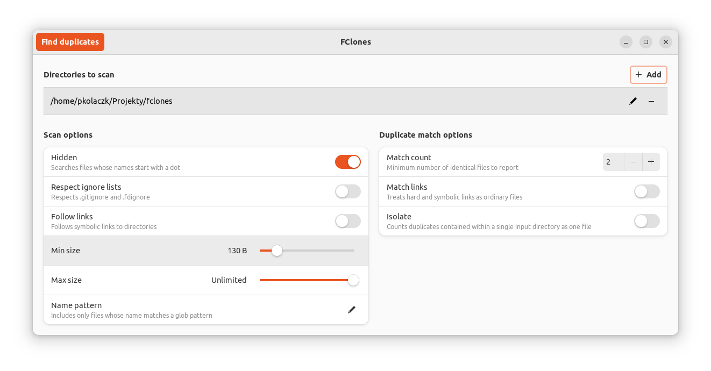
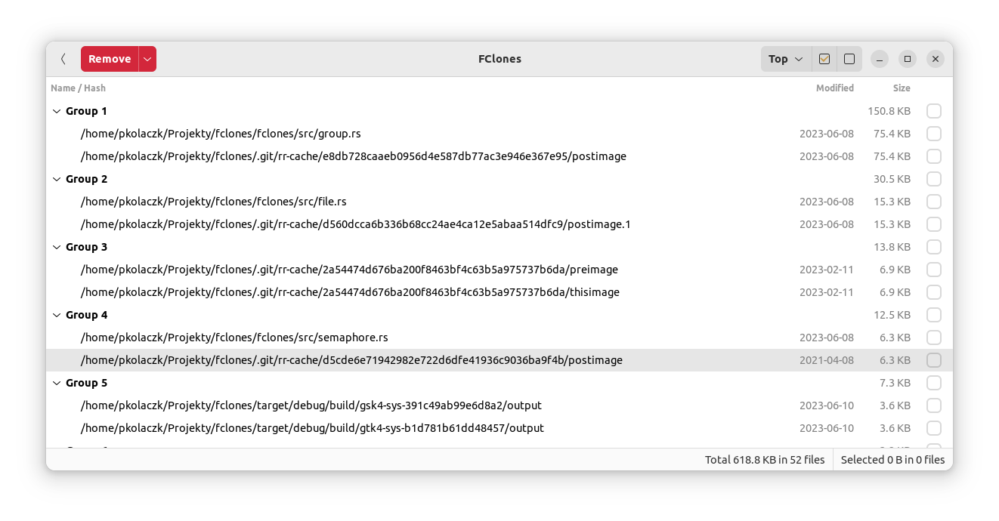

fclones
===============================================
**Efficient duplicate file finder and remover**

This repository contains sources of two related Rust projects: fclones and fclones-gui.

## [fclones](fclones/README.md)
The most feature-rich and flexible version of fclones.
Uses command line interface.
Can deduplicate terabytes of data.

    $ mkdir test
    $ cd test
    $ echo foo >foo1.txt
    $ echo foo >foo2.txt
    $ echo foo >foo3.txt
    $ echo bar >bar1.txt
    $ echo bar >bar2.txt

    $ fclones group . >dupes.txt
    [2021-06-05 18:21:33.358] fclones:  info: Started grouping
    [2021-06-05 18:21:33.738] fclones:  info: Scanned 7 file entries
    [2021-06-05 18:21:33.738] fclones:  info: Found 5 (20 B) files matching selection criteria
    [2021-06-05 18:21:33.738] fclones:  info: Found 4 (16 B) candidates after grouping by size
    [2021-06-05 18:21:33.738] fclones:  info: Found 4 (16 B) candidates after grouping by paths and file identifiers
    [2021-06-05 18:21:33.739] fclones:  info: Found 3 (12 B) candidates after grouping by prefix
    [2021-06-05 18:21:33.740] fclones:  info: Found 3 (12 B) candidates after grouping by suffix
    [2021-06-05 18:21:33.741] fclones:  info: Found 3 (12 B) redundant files

    $ cat dupes.txt
    # Report by fclones 0.12.0
    # Timestamp: 2021-06-05 18:21:33.741 +0200
    # Command: fclones group .
    # Found 2 file groups
    # 12 B (12 B) in 3 redundant files can be removed
    7d6ebf613bf94dfd976d169ff6ae02c3, 4 B (4 B) * 2:
        /tmp/test/bar1.txt
        /tmp/test/bar2.txt
    6109f093b3fd5eb1060989c990d1226f, 4 B (4 B) * 3:
        /tmp/test/foo1.txt
        /tmp/test/foo2.txt
        /tmp/test/foo3.txt

## [fclones-gui](fclones-gui/README.md)

An interactive version built using GTK+. 
Uses the same duplicate finding and removal engine as the CLI tool, but 
it is substantially easier to use. 

