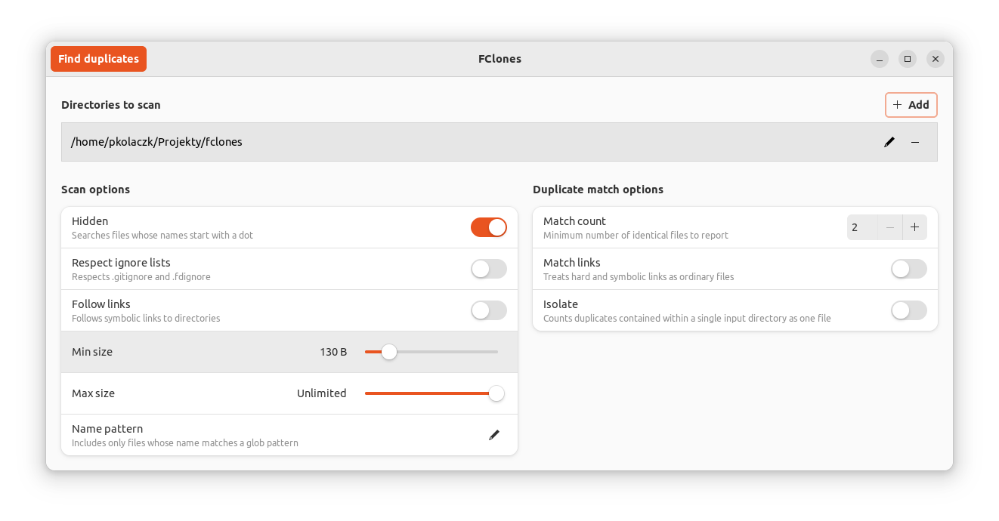
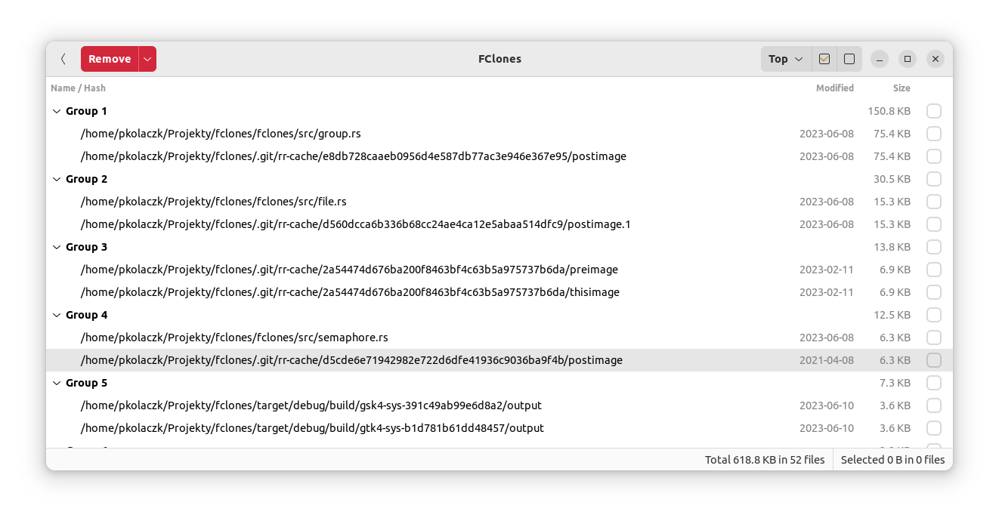

GUI for fclones
=======================
**Allows interactive removal of duplicate files**

---

Warning: This is a very early preview version.
Not all features of fclones are exposed. 
This hasn't been thoroughly tested.




## Installation

Assuming you have Rust toolchain and GTK4 development libraries installed on your system,
you should be able to build it from source with the following command:

```shell
cargo install fclones-gui
```

## Usage
Should be self-explanatory. If it is not, then let me know by opening issues. ;)

Nevertheless, the workflow is as follows:

1. Select / add the directories you want to scan for duplicates.
2. Adjust options if needed.
3. Press the "Find duplicates" button. 
4. After search is complete, a list of file groups will be displayed.
5. Select files you want to get rid of. 
6. Select how you want to get rid of them, using the dropdown at the red button. 
7. Press the red button (warning: this *is* a destructive action).

You can remove duplicates many times without rerunning the search.
You can also go back to the input page and modify your scan settings.

## Reporting issues
Please report issues in GitHub Issues.
Don't forget to specify your OS and GTK4 version.
I've run into several GTK4 bugs while working with this project.
